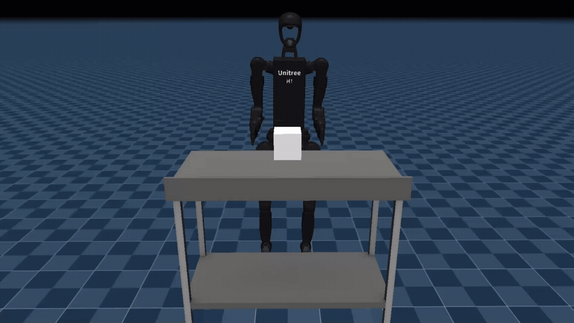
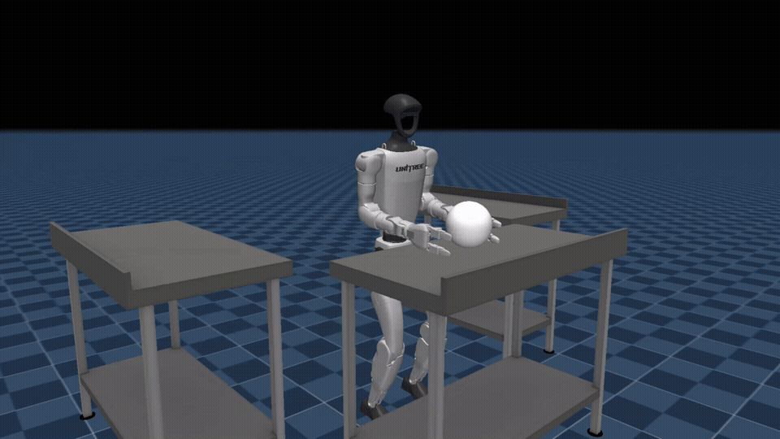
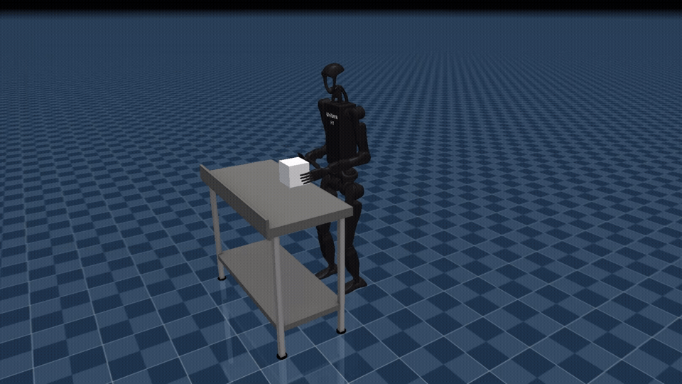
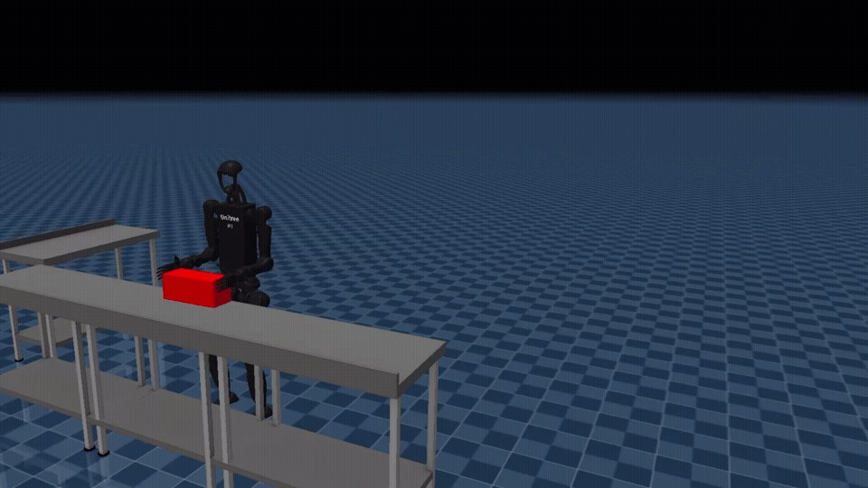

# ANY_ROBOT

Simulation playground for controlling Unitree humanoid robots with natural-language commands through VLM/LLM-generated joint actions.

## Quick start

Install `uv`:

```bash
pip install uv
```

### Single robot

```bash
uv run any_robots.py --robot h1_2
```

Available robot options: `g1`, `h1`, `h1_2`.

### Voice control for two robots

Press `V` to start the realtime LLM dialogue:

```bash
uv run any_ag_micro.py
```

### Three twin robots

```bash
uv run any_3h1_2.py
```

### Three-robot grasp experiment

```bash
uv run any_3h1_2_grab.py
```

### A* obstacle-avoidance version

```bash
uv run any_robots_map.py
```

## Repository layout

### Main entrypoints

- `any_robots.py` — generic single-robot launcher (`--robot g1|h1|h1_2`).
- `any_ag_micro.py` — voice/realtime-agent scenario.
- `any_3h1_2.py` — three-robot scenario.
- `any_3h1_2_grab.py` — three-robot grasp experiment.
- `any_robots_map.py` — obstacle avoidance with A*.

### Shared runtime modules

- `llm_providers.py`, `openai_llm.py` — LLM provider integration.
- `settings.py` — runtime/RAG settings.
- `demo_player.py` — demo/action loading helpers.
- `sim_phrases.py` — phrase similarity and few-shot helpers.

These modules remain in the repository root because current entrypoints import them directly.

### Additional / experimental entrypoints

- `any_twh1_2.py` — additional multi-robot experiment.
- `wb_twins.py` — earlier twin-robot implementation retained for compatibility/history.
- `experiments/` — self-contained experimental scripts that do not need to stay in the root.
- `tools/` — one-off repository/model utilities.
- `archive/` — obsolete scaffolding retained instead of deleting it.
- `docs/` — generated/reference documentation.

### Data and assets

- `best/` — selected motion JSON files.
- `g1-rag/`, `h1_2/` — robot-specific motion/RAG assets.
- `recorded/` — recorded GIF examples.
- `unitree_rl_gym/` — Unitree RL simulation resources and policies.

## How it works

The VLM receives a prompt containing the robot description, current joint names and values, and a command from the user in natural language.

The model returns a JSON array containing joints and target angles. For example, the command `Raise your right hand up` can produce something like:

```json
[
  {
    "frame": [
      {"name": "right_shoulder_pitch_joint", "angle": -185},
      {"name": "right_elbow_joint", "angle": 90}
    ],
    "duration": 1
  }
]
```

## Examples






<p align="center">
  
</p>
