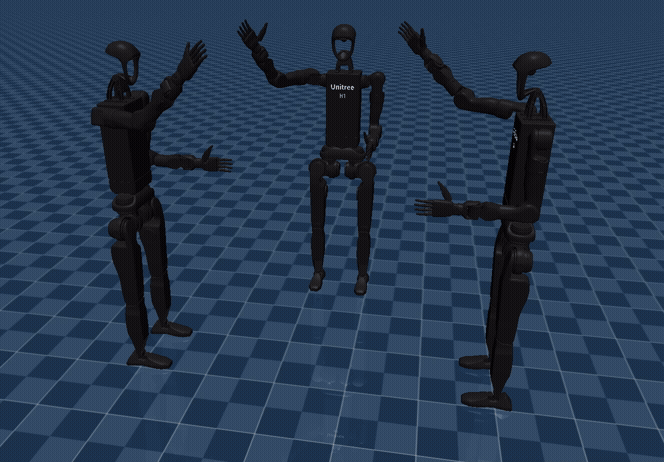

# ANY_ROBOT

Simulation playground for controlling Unitree humanoid robots with natural-language commands through VLM/LLM-generated joint actions.

<p align="center">
  
</p>

<p align="center">
  
</p>

## Quick start

Install `uv`:

```bash
pip install uv
```

Run commands from the repository root. Runtime paths such as `unitree_rl_gym/...` are resolved relative to the repository root.

### Repository check

Before running a simulation, verify Python syntax and required runtime assets:

```bash
bash checks/repository.sh
```

### Single robot

```bash
uv run app/any_robots.py --robot h1_2
```

Available robot options: `g1`, `h1`, `h1_2`.

### Voice control for two robots

Press `V` to start the realtime LLM dialogue:

```bash
uv run app/any_ag_micro.py
```

### Three twin robots

```bash
uv run app/any_3h1_2.py
```

### Three-robot grasp experiment

```bash
uv run app/any_3h1_2_grab.py
```

### A* obstacle-avoidance version

```bash
uv run app/any_robots_map.py
```

## Repository layout

```text
.
├── app/                 # runnable simulation code + shared Python modules
├── data/                # motion and RAG assets
├── media/               # demo GIFs and visual examples
├── legacy/              # retained older/standalone implementations
├── utilities/           # one-off model/repository utilities
├── checks/              # repository sanity checks
├── docs/                # generated/reference documentation
├── unitree_rl_gym/      # Unitree RL simulation resources and policies
├── prompt.txt           # current base prompt (kept at root for runtime compatibility)
├── prompt_twins.txt     # twin-robot prompt (kept at root for runtime compatibility)
├── pyproject.toml
└── uv.lock
```

### `app/`

Main entrypoints:

- `app/any_robots.py` — generic single-robot launcher (`--robot g1|h1|h1_2`).
- `app/any_ag_micro.py` — voice/realtime-agent scenario.
- `app/any_3h1_2.py` — three-robot scenario.
- `app/any_3h1_2_grab.py` — three-robot grasp experiment.
- `app/any_robots_map.py` — obstacle avoidance with A*.

Additional retained entrypoints:

- `app/any_twh1_2.py` — additional multi-robot experiment.
- `app/wb_twins.py` — earlier twin-robot implementation retained for compatibility/history.

Shared runtime modules are kept beside the entrypoints so the current imports continue to work without refactoring:

- `app/llm_providers.py`
- `app/openai_llm.py`
- `app/settings.py`
- `app/demo_player.py`
- `app/sim_phrases.py`

### `data/`

```text
data/
├── motions/
│   └── best/            # selected motion JSON files
└── rag/
    ├── g1/              # G1 RAG/motion assets
    ├── h1_2/            # H1_2 RAG/motion assets
    └── rag_best.csv
```

### Other folders

- `media/demos/` — recorded GIF examples.
- `legacy/amin_sim2.py` — retained standalone multi-robot simulation version.
- `legacy/main.py` — old placeholder entrypoint retained rather than deleted.
- `utilities/modify.py` — XML/model modification utility.
- `checks/repository.sh` — syntax and runtime-asset sanity check.
- `docs/README.pdf` — previous generated PDF documentation.

## How it works

The VLM receives a prompt containing the robot description, current joint names and values, and a command from the user in natural language.

The model returns a JSON array containing joints and target angles. For example, the command `Raise your right hand up` can produce something like:

```json
[
  {
    "frame": [
      {"name": "right_shoulder_pitch_joint", "angle": -185},
      {"name": "right_elbow_joint", "angle": 90}
    ],
    "duration": 1
  }
]
```

## Examples


